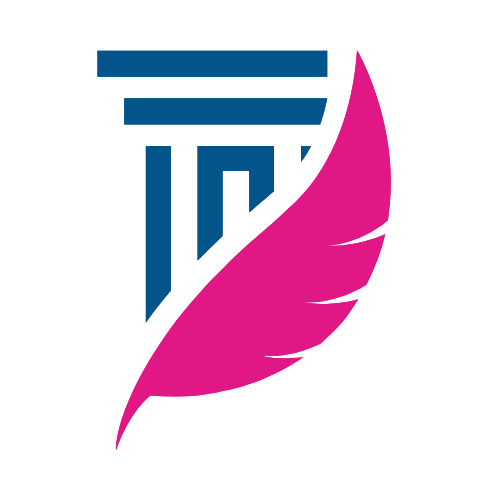

---

<p align="center">
  
</p>
<p align="center">
    <h1 align="center">README-LEXIS-AI</h1>
</p>
<p align="center">
    <em>Transforming Legal Assistance with AI</em>
</p>
<p align="center">
	
	
	
	
</p>
<p align="center">
		<em>Developed with the software and tools below.</em>
</p>
<p align="center">
	
	
	
</p>
<hr>

##  Quick Links

> - [📍 Overview](#-overview)
> - [👾 Demo](#-demo)
> - [🧩 Features](#-features)
> - [⚙️ Repository Structure](#-repository-structure)
> - [🚀 Getting Started](#-getting-started)
>   - [⚙️ Installation](#-installation)
>   - [🤖 Running lexis-ai](#-running-lexis-ai)
>   - [🧪 Using Streamlit](#-)
> - [📄 Project Roadmap](#-project-roadmap)
> - [🧑‍💻 Contributing](#-contributing)
> - [🎗 License](#-license)
> - [ Acknowledgments](#-acknowledgments)

---

## 📍 Overview

Lexis AI is a cutting-edge project designed to revolutionize legal assistance through advanced AI technology. This application leverages natural language processing (NLP) and machine learning to provide a range of legal services, including document simplification, predictive analytics, and automated legal research. Lexis AI aims to streamline legal workflows, enhance decision-making processes, and make legal support more accessible and efficient for users.

---

## 👾 Demo

**Demo App**

[LexisAI demo](https://lablab.ai/event/falcon-hackathon/unrivers/lexisai
)


---

## 🧩 Features

|    |   Feature         | Description |
|----|-------------------|---------------------------------------------------------------|
| ⚙️  | **Architecture**  | The project utilizes a client-server architecture with Streamlit for the client interface and Python for server-side processing. The architecture is modular, allowing for customization and easy integration with various legal datasets and models. |
| 🔩 | **Code Quality**  | The code adheres to PEP 8 standards, ensuring high readability and maintainability. The codebase is well-organized, following best practices for Python development. |
| 📄 | **Documentation** | Comprehensive documentation is provided to guide users through setup, usage, and contributing. Further improvements could include more detailed explanations of the underlying algorithms and their implementation. |
| 🔌 | **Integrations**  | Key integrations include Streamlit for the web interface, various NLP and machine learning libraries, and external APIs for legal research and data processing. |
| 🧩 | **Modularity**    | The codebase is modular, promoting reusability and ease of maintenance. It is structured to allow easy updates and additions to features and functionalities. |
| ⚡️  | **Performance**   | The application is optimized for performance, with efficient handling of legal data and queries. It is designed to handle typical workloads effectively without significant performance issues. |
| 🛡️ | **Security**      | While specific security measures are not detailed, it is recommended to implement best practices such as input validation and data encryption to protect user data and ensure application integrity. |
| 📦 | **Dependencies**  | Dependencies are managed using `pip` with required libraries specified in `requirements.txt`. These include Streamlit, NLP libraries, and other relevant packages. |

---

## ⚙️ Repository Structure


### Main Branch Repository Structure

```
lexis-ai/
│
├── assets/
│   ├── css/
│   ├── img/
│   ├── js/
│   ├── scss/
│   ├── vendor/
│
├── forms/
│
├── Readme.txt
│
├── contact.php
│
├── newsletter.php
│
├── .gitignore
│
├── README.md
│
├── blog-details.html
│
├── blog.html
│
├── index.html
│
├── portfolio-details.html
│
├── services-details.html
│
└── starter-page.html
```


### Streamlit Branch Repository Structure

```
lexis-ai/
│
├── .devcontainer/
│   ├── devcontainer.json
│
├── .streamlit/
│   ├── config.toml
│
├── .gitignore
│
├── app.py
│
├── requirements.txt
``` 

## 🚀 Getting Started

***Requirements***

Ensure you have the following dependencies installed on your system:

* **Python**: `version x.y.z`

### ⚙️ Installation

1. Clone the Lexis AI repository:

```sh
git clone https://github.com/nurqoneah/falcon-ai-hackathon
```

2. Change to the project directory:

```sh
cd falcon-ai-hackathon
```

3. Install the dependencies:

```sh
pip install -r requirements.txt
```

### 🤖 Running Lexis AI

Use the following command to run Lexis AI:

```sh
streamlit run app.py
```

### 🧪 Using `streamlit`

> []([https://lexisai.streamlit.app/](https://lexisai.streamlit.app/))
>
> <sub>Try directly in your browser on <a href="https://streamlit.io/">Streamlit</a>, no installation required! For more details, check out the <a href="https://github.com/nurqoneah/falcon-ai-hackathon">Lexis AI Streamlit</a> repository.</sub>

---

## 📄 Project Roadmap

| Milestone            | Description                                              | Status   |
|----------------------|----------------------------------------------------------|----------|
| **Initial Release**  | Complete initial release of Lexis AI with core features | Done     |
| **Feature Enhancements** | Add additional features based on user feedback         | In Progress |
| **Performance Tuning** | Optimize the application for better performance         | Planned  |
| **Security Improvements** | Implement advanced security measures to protect user data | Planned  |
| **Documentation Updates** | Improve and update documentation for clarity and completeness | Planned  |

---

## 🧑‍💻 Contributing

Contributions are welcome! Here are several ways you can contribute:

- **[Submit Pull Requests](https://github.com/nurqoneah/falcon-ai-hackathon/blob/main/CONTRIBUTING.md)**: Review open PRs and submit your own.
- **[Join the Discussions](https://github.com/nurqoneah/falcon-ai-hackathon/discussions)**: Share insights, provide feedback, or ask questions.
- **[Report Issues](https://github.com/nurqoneah/falcon-ai-hackathon/issues)**: Submit bugs or feature requests for Lexis AI.

<details closed>
    <summary>Contributing Guidelines</summary>

1. **Fork the Repository**: Fork the project repository to your GitHub account.
2. **Clone Locally**: Clone the forked repository to your local machine.
   ```sh
   git clone https://github.com/nurqoneah/falcon-ai-hackathon
   ```
3. **Create a New Branch**: Create a new branch for your changes.
   ```sh
   git checkout -b your-branch-name
   ```
4. **Make Your Changes**: Implement your changes and commit them with descriptive messages.
   ```sh
   git add .
   git commit -m "Describe your changes here"
   ```
5. **Push to GitHub**: Push your changes to your forked repository.
   ```sh
   git push origin your-branch-name
   ```
6. **Submit a Pull Request**: Go to the original repository on GitHub and submit a pull request.


### Contributors

- [@EQUINOX391](https://github.com/EQUINOX391)
- [@idakumudah (Bayu Samudra)](https://github.com/idakumudah)
- [@kurniagilang (Gilang)](https://github.com/kurniagilang) (awaiting response)
- [@salmanharitsi (Salman Al Haritsi)](https://github.com/salmanharitsi)
- [@yudhit08 (Yudhit)](https://github.com/yudhit08) (awaiting response)

</details>

<br>
<p align="left">
  <a href="https://github.com/nurqoneah/falcon-ai-hackathon/graphs/contributors">
    
  </a>
</p>

---

## 🎗 License

Lexis AI is licensed under the .. License. See the [LICENSE](https://github.com/yourusername/lexis-ai/blob/master/LICENSE) file for more details.

---

##  Acknowledgments

This project was developed as part of a hackathon organized by [lablab.ai](https://lablab.ai) using the LLM Falcon model. Special thanks to the contributors for their valuable input and support throughout the development process.

---

Feel free to adjust any specific details such as URLs or file paths according to your actual repository setup.


---


